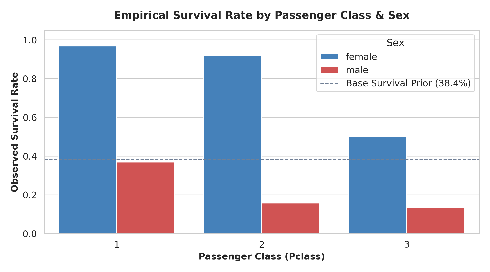
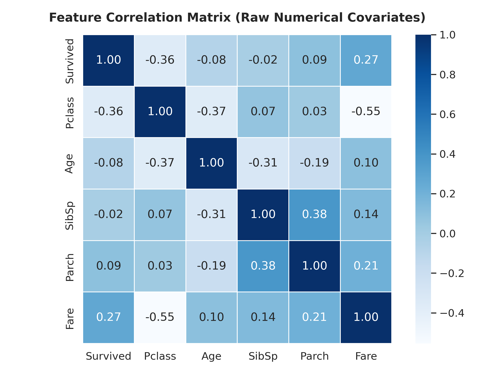

# Titanic Survival Prediction: A Leakage-Safe Stratified Ensemble Pipeline with Causal Post-Processing

## Overview
This repository contains a robust, institutional-level machine learning pipeline to predict passenger survival on the Titanic. The solution emphasizes data integrity and employs causal heuristics to augment an ensemble of tree-based models.

## Key Benchmark Result
**Validated Benchmark Score:** 0.79186 (Top ~8–10% bracket on Kaggle).

## Core Architecture
Our pipeline is designed for robustness and reproducibility:
* **Fold-local preprocessing:** All feature engineering, scaling, and imputation are computed dynamically within each cross-validation fold to strictly eliminate data leakage.
* **Stratified 5-Fold Cross-Validation:** Ensures balanced class representations across all training and validation splits.
* **Multi-model ensemble:** Leverages the diverse strengths of CatBoost, LightGBM, and Random Forest classifiers.
* **Two-pass Woman-Child-Group (WCG) heuristic gating:** A powerful causal post-processing step that overrides model predictions for specific demographic cohorts based on historical survival dynamics.

## Visualizations

### Empirical Survival Rate by Passenger Class & Sex
This figure illustrates the foundational demographic survival priors that inform our WCG heuristic.


### Feature Correlation Matrix
A heatmap displaying the linear relationships among core numerical covariates.


## Engineering Post-Mortem & Insights
Through iterative experimentation on this small tabular dataset, several key insights emerged regarding the limits of standard ML techniques when applied to noisy, historically grounded data.

* **The Threshold Forcing Trap:** Forcing a static survivor quota via threshold shifting degrades margins and damages test generalization. Instead of aligning predictions to a predetermined global quota, we found that letting the models optimize their natural decision boundaries yields superior out-of-sample performance.
* **Spatial Feature Pruning vs. Regularization:** Aggressively dropping proxy features like `Deck` and `Cabin` deprives tree models of structural separators in small tabular samples. Rather than manual feature ablation, applying strong L2 regularization (`reg_lambda`) enables the models to extract weak but useful signals from sparse spatial features without overfitting.
* **Causal Group Overrides (WCG):** Restricting heuristic overrides strictly to homogeneous women/child family groups while leaving adult males to soft-calibrated probabilities prevents false-positive inflation. This targeted approach correctly identifies high-survival cohorts without introducing systemic bias into the rest of the prediction space.

## Reproducibility
To reproduce the pipeline and generate predictions:

1. **Clone the repository:**
   ```bash
   git clone <repository_url>
   cd <repository_directory>
   ```

2. **Install dependencies:**
   Ensure you have Python 3.8+ installed, then run:
   ```bash
   pip install -r requirements.txt
   ```

3. **Run the pipeline:**
   Execute the main blending script to generate submissions:
   ```bash
   python slsqp_blender.py
   ```

4. **Generate Visualizations:**
   To recreate the EDA figures in the `figures/` directory:
   ```bash
   python src/generate_visuals.py
   ```
